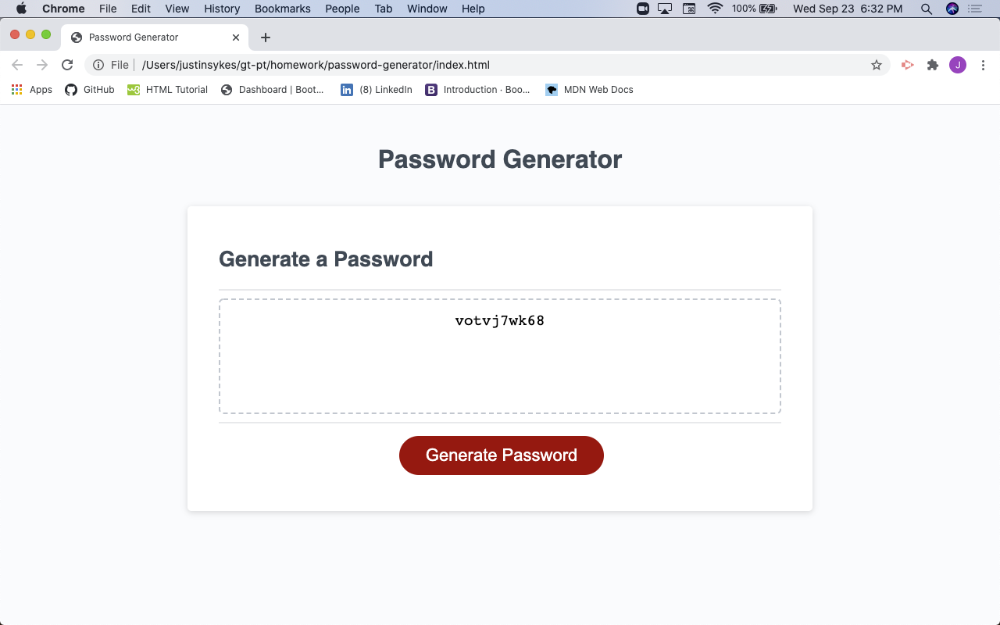

# password-generator

Webpage with a centered card that allows a user to generate a custom password using the following criteria.
- 8 to 128 characters in length
- user selections avaialbe for:
    - uppercase letters
    - lowercase letters
    - numbers
    - special characters

URL of deployed app: https://204039643.github.io/02-responsive-portfolio/

- [Installation](#installation)
- [Usage](#usage)
- [Credits](#credits)
- [License](#license)

## Installation

Clone my Github reposity to your local machine: https://github.com/204039643/password-generator

## Usage

1. Open local repository in VS code (code .).
2. Navigate to the index.html, style.css, or script.js files in the editor to view.
3. To view in your web browser, with the index.html file selecetd in the editor, right-click and select 'Open in default browser'.
4. Click generate password button.
5. Respond to prompts for user selection criteria.
6. When complete with prompts, new password will populate in center of webpage card containter element.

## Credits

W3C Schools HTML JavaScript: https://www.w3schools.com/js/default.asp
MDN web dics JavaScript: https://developer.mozilla.org/en-US/docs/Web/JavaScript

## License

MIT License

Copyright (c) [2020] [Justin Sykes]

Permission is hereby granted, free of charge, to any person obtaining a copy
of this software and associated documentation files (the "Software"), to deal
in the Software without restriction, including without limitation the rights
to use, copy, modify, merge, publish, distribute, sublicense, and/or sell
copies of the Software, and to permit persons to whom the Software is
furnished to do so, subject to the following conditions:

The above copyright notice and this permission notice shall be included in all
copies or substantial portions of the Software.

THE SOFTWARE IS PROVIDED "AS IS", WITHOUT WARRANTY OF ANY KIND, EXPRESS OR
IMPLIED, INCLUDING BUT NOT LIMITED TO THE WARRANTIES OF MERCHANTABILITY,
FITNESS FOR A PARTICULAR PURPOSE AND NONINFRINGEMENT. IN NO EVENT SHALL THE
AUTHORS OR COPYRIGHT HOLDERS BE LIABLE FOR ANY CLAIM, DAMAGES OR OTHER
LIABILITY, WHETHER IN AN ACTION OF CONTRACT, TORT OR OTHERWISE, ARISING FROM,
OUT OF OR IN CONNECTION WITH THE SOFTWARE OR THE USE OR OTHER DEALINGS IN THE
SOFTWARE.
